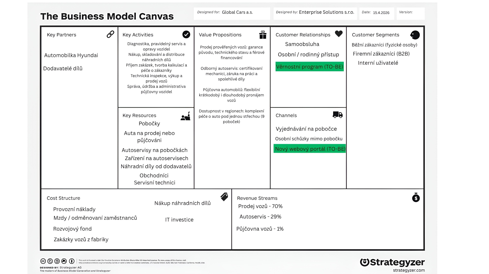
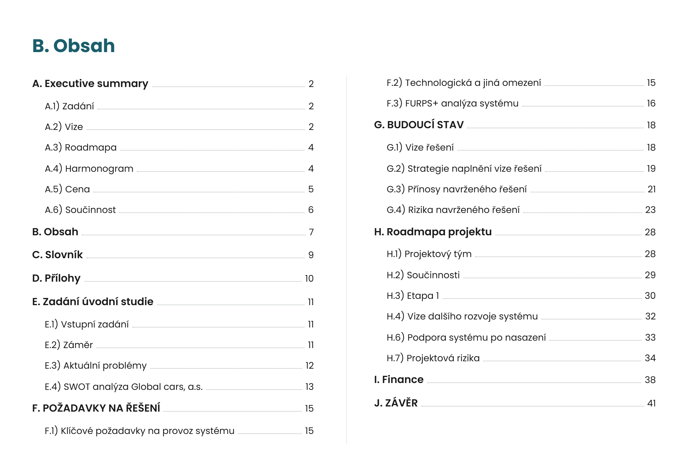
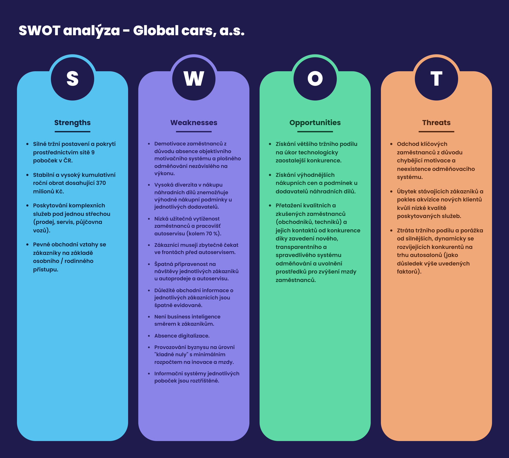
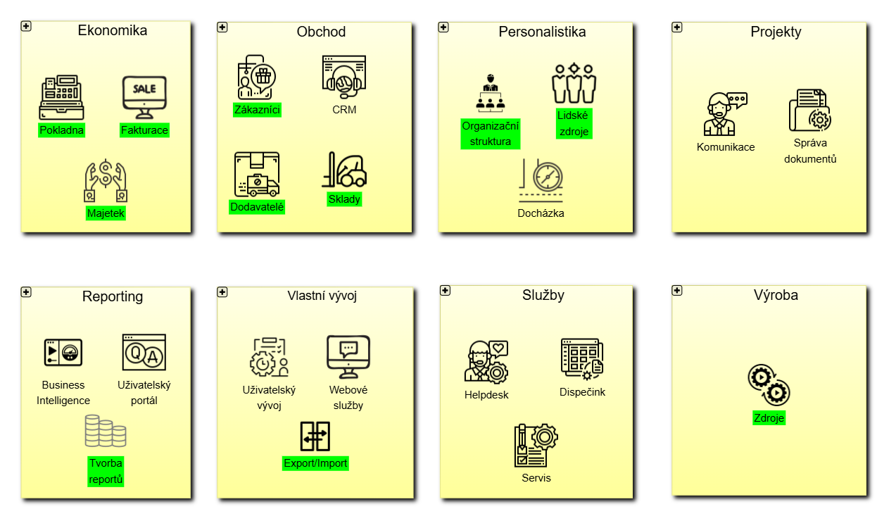
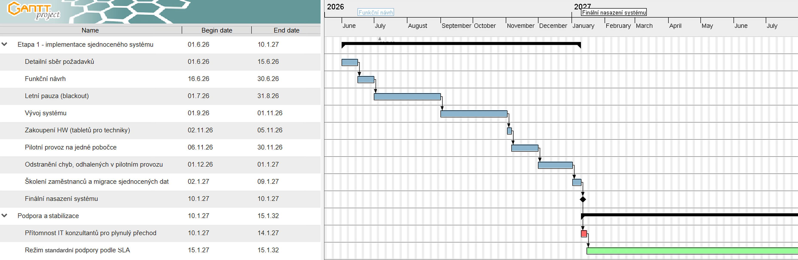
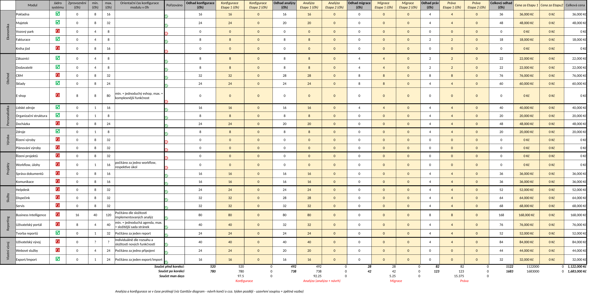

# Global cars, a.s. - Information System Solution Design

> **Institution:** CTU FEE (ČVUT FEL) | **Course:** B6B16INS (Information Systems)  
> 
> **Project:** Comprehensive IS solution design for the Global cars, a.s. dealership network in the Czech Republic.  
> 
> **Key competencies:** IT analytics, client meetings, process mapping, BPMN 2.0, functional prototype delivery, product ownership, client presentations, ERP, CRM, IS design, modular IS shipment and licensing.  
> 
> **Language:** Czech (Project deliverables) / English (Portfolio overview)

---

## Contents

1. [Business Case](#business-case)
   - [AS-IS Operational Reality and Company Profile](#as-is-operational-reality-and-company-profile)
   - [Business Model Canvas (BMC)](#business-model-canvas-bmc)
   - [Project Charter - Document A4](#project-charter---document-a4)
2. [Client Stakeholder Consultations](#client-stakeholder-consultations)
3. [IS Solution Design (Úvodní studie)](#is-solution-design)
   - [Report Structure](#report-structure)
   - [Key Highlights](#key-highlights)
4. [Process Engineering - BPMN 2.0](#process-engineering)
5. [Functional Prototype](#functional-prototype)
6. [Team Working Environment Logs - GitLab Wiki Pages (CZ)](#team-working-environment-logs---gitlab-wiki-pages)
   - [Projektový tým a role](#projektový-tým-a-role)
   - [Rizika projektu](#rizika-projektu)
   - [Evidence odpracovaných hodin a úkolů](#evidence-odpracovaných-hodin-a-úkolů)
   - [Závěrečné hodnocení členů týmu](#závěrečné-hodnocení-členů-týmu)
7. [Authors](#authors)

---

## Business Case

The initial business context, client operational baseline, and project assignment are defined in the university task specification:
- 📄 **University Assignment Document (Karta zákazníka):** [`Business-Case.pdf`](Business-Case.pdf)   *(original Czech assignment brief from CTU FEE)*

---

### AS-IS Operational Reality and Company Profile

**Global cars, a.s.** is a Czech automotive company operating an authorized dealership and service network for **Hyundai** passenger vehicles (sales, maintenance/repairs, and auxiliary short-term car rental). Headquartered in Prague (with registered capital of CZK 2,000,000 and approximately 80 employees), the company grew rapidly through acquisitions:
- **Network Expansion & Ownership:** Established two years prior through the acquisition of 6 dealerships (*Praha, Plzeň, Pardubice, Liberec, Tábor, Jihlava*), the network subsequently expanded to 9 branches across the Czech Republic by acquiring additional locations in *Brno, Olomouc, and Ostrava*. The business is 100% owned by a single private investor who funded the acquisition with capital gained from stock market investments. Management resides at the Prague headquarters and consists primarily of the owner's family members, operating the enterprise on a family-business model.
- **Core Operations vs. Auxiliary Activities:** Primary business revenue is driven by new and pre-owned vehicle sales and authorized vehicle service. Vehicle rental is run purely as a complementary service.

#### Structural Bottlenecks & AS-IS Deficiencies:
- **Operational Fragmentation Across Branches:** Following the rapid acquisition wave, all 9 branches continued to function completely autonomously. Each dealership maintained disparate local workflows, separate uncoordinated local suppliers for spare parts and shop supplies, and disconnected legacy software tools. There was no central data exchange, shared vehicle service history, or cross-branch inventory visibility.
- **Neglected ICT Infrastructure:** Executive leadership and local branch managers traditionally placed paramount emphasis on face-to-face customer relationships, priding themselves on above-standard personal customer care. Due to this mindset, systemic ICT development was heavily neglected. The company had no unified website, no central Customer Relationship Management (CRM) system, and no digital reservation or self-service scheduling platform.
- **Economic Vulnerability:** In the face of macroeconomic stagnation and rising operational overhead, the lack of centralized oversight, duplicated administrative work, and inefficient vehicle service scheduling began severely depressing profit margins and threatening the firm's financial sustainability.

---

### Business Model Canvas (BMC)

To systematically evaluate the company's business model and align strategic requirements, the **Business Model Canvas (BMC)** methodology was applied. It provides a structured evaluation across 9 fundamental blocks: Key Partners, Key Activities, Key Resources, Value Propositions, Customer Relationships, Channels, Customer Segments, Cost Structures, and Revenue Streams.

<em>Figure 1: Business Model Canvas - Global cars, a.s.</em>

- 📄 **Business Model Canvas Document (PDF):** [`0730-BMC-AUTA-2026-03-18.pdf`](uploads/0730-BMC-AUTA-2026-03-18.pdf)

---

### Project Charter - Document A4

The **Document A4** is the initial project charter and business proposal delivered to the client, **Global cars, a.s.** 

Within the project, our team operated in the role of **Enterprise Solutions, s.r.o.** - an external IT contractor specializing in custom enterprise software development and systems modernization (*vývoj a modernizace IS na klíč*). The document establishes the project scope, bilateral business motivations, resource constraints, and executive governance prior to commencing detailed analytical work:
- **Problem Statement & Scope:** Formal mandate to overcome operational fragmentation across branches and design a centralized, process-unified IS solution spanning dealership sales and service bay management.
- **Client & Contractor Motivations:**
  - *Client Motivation:* Halting economic stagnation, modernizing business operations in line with contemporary industry standards, and interconnecting all 9 branches through a unified Information System.
  - *Contractor Motivation:* Entering the automotive enterprise IT domain, acquiring an authoritative industry reference, and expanding analytical and architectural competencies of their team.
- **Acceptance Criteria & Delivery Constraints:**
  - The fact of the client's sign-off on the target conceptual solution (*Úvodní studie*) that demonstrably and logically solves identified operational bottlenecks.
  - Strict compliance with delivery milestones and schedule.
  - Human resource and cost ceiling: 5-member contractor analytical team capped at a maximum of **300 billable man-hours** (total contract price of CZK 300,000 at CZK 1,000/hour; internal contractor team costs of CZK 225,000; 20 client consultation hours).
- **Steering Committee & Stakeholder Governance:** Establishes the joint executive steering committee (*Řídící komise*) consisting of client leadership sponsors (Commercial Director Jan Kočí, Sales Representative Pavel Náplava) and contractor leadership (Project Manager Mykhailo Plokhin, Lead Analyst Ivan Shestachenko).

📄 **Project Charter (Document A4):** [`0730-A4-AUTA-2026-03-03.pdf`](uploads/0730-A4-AUTA-2026-03-03.pdf)

---

## Client Stakeholder Consultations

The primary objective of the stakeholder consultations was to develop a deep domain understanding of the client's business, identify operational pain points directly from personnel across multiple organizational levels, map core business processes, and get the answers to all relevant questions required to engineer an optimal solution design covering the needs and nuances of the client's business.

To ensure real-world analytical training, the roles of client stakeholders were simulated by our course instructors, **Ing. Jan Kočí, Ph.D.** and **Ing. Pavel Náplava, Ph.D.** In each session, they strictly maintained the realistic information scope, perspective, and operational domain knowledge of the assigned role, requiring our team to ask questions that were relevant to each interviewee's sphere of competence.

Each consultation followed a formal protocol: our team produced an advance preparation document (*Příprava na jednání*) outlining key topics and hypotheses, and concluded with an official meeting record (*Zápis z jednání*) to register the client's statements and requirements without subjective assumptions.

| Consultation | Client Stakeholder (Role) | Focus Area | Deliverables |
|:---|:---|:---|:---|
| **Consultation 1** *(05.03.2026)* | **Commercial Director** *(Jan Kočí)* | • Strategic vision, dealership network expansion history, and family-business governance • Executive rationale for branch autonomy vs. systemic impact on profitability • Commercial priorities, network-wide stagnation, and target transformation objectives | 📄 [Preparation Brief](uploads/0730-Priprava-AUTA-2026-03-05-1.pdf) 📝 [Meeting Record](uploads/0730-Zapis-AUTA-2026-03-05.pdf) |
| **Consultation 2** *(12.03.2026)* | **Branch Manager (Ostrava)** *(Jan Kočí)* | • Daily regional operations, local staff coordination, and branch autonomy limits • Operational pain points: decentralized parts purchasing, lack of shared inventory, and scheduling friction • Branch personnel digital readiness, change appetite, and local efficiency metrics | 📄 [Preparation Brief](uploads/0730-Priprava-AUTA-2026-03-12.pdf) 📝 [Meeting Record](uploads/0730-Zapis-AUTA-2026-03-12.pdf) |
| **Consultation 3** *(26.03.2026)* | • **Service Advisor (Ostrava)** *(Jan Kočí)*  • **Deputy Head of Sales (Ostrava)** *(Pavel Náplava)* | • **Sales:** Dealership sales routines, B2B/B2C client tracking, and CRM customer profile needs • **Service:** Frontline vehicle intake, repair booking friction, and customer communication bottlenecks • **Workshop:** Diagnostic bay handoff, mechanic tablet interface requirements, and customer extra-work approval | 📄 [Preparation Brief](uploads/0730-Priprava-AUTA-2026-03-26.pdf) 📝 [Meeting Record](uploads/0730-Zapis-AUTA-2026-03-26.pdf) |
| **Consultation 4** *(09.04.2026)* | **Branch Manager (Ostrava)** *(Jan Kočí)* | • Practical review of TO-BE system architecture and proposed workflow feasibility at branch level • Validation of technician incentive bonus formulas and workshop tablet integration • Financial verification: local hardware budgeting, staff training rollout, and pilot deployment | 📄 [Preparation Brief](uploads/0730-Priprava-AUTA-2026-04-09.pdf) 📝 [Meeting Record](uploads/0730-Zapis-AUTA-2026-04-09.pdf) |

---

## IS Solution Design (Úvodní studie)

The **IS Solution Design (Úvodní studie)** represents the master deliverable and comprehensive final report of the project. It begins with a detailed baseline analysis of the client's current operational state, followed by a complete evaluation of all aspects of the proposed solution and its implementation - covering structural and architectural design, fulfillment of functional and non-functional requirements (FURPS+), project schedule, risk management, financial calculations.

📄 **Final Report Document (Full Master Deliverable):** [`Solution-Design-Report-Final.pdf`](Solution-Design-Report-Final.pdf)

---

### Report Structure

The complete study spans over 40 pages and covers such topics of analysis as diagnostic, architectural, requirements engineering, schedule, risk, financial, and more:

<em>Figure 2: Solution Design Final Report - Table of Contents</em>

---

### Key Highlights

#### SWOT Analysis and Strategy
Based on the conducted SWOT analysis, the project adopts a **MIN-MAX (Turnaround)** strategy. The evaluation revealed critical operational weaknesses across the dealership network - branch isolation, manual paperwork, and no centralized inventory or CRM - which directly threaten company profitability. The priority is to eliminate these internal bottlenecks first, establishing a solid operational baseline to capture market opportunities, improve margins, and strengthen competitive position:

<em>Figure 3: SWOT Analysis Matrix - Global cars, a.s.</em>

 

#### Modular System Architecture
As our team is operating in the role of external IT contractor (**Enterprise Solutions, s.r.o.**), the proposed solution centers on the shipment of our company's established modular enterprise software product. The system architecture distinguishes between a standard **Core module package** included under the **baseline license** (highlighted in green in the diagram) and advanced functional modules licensed and delivered separately. Each module is customized to the client's operational workflows, with historical data migrated from existing legacy tools as needed. The final agreed modular architecture tailored to Global cars, a.s. is illustrated below:

<em>Figure 4: Proposed IS Modular Architecture (Core modules in green)</em>

 

#### Project Harmonogram
The project realization schedule is structured into distinct delivery phases: requirements mapping, system design, implementation, testing, staff training, branch rollout, and ongoing support. Each stage is scheduled around the client's operational capacity and designated availability windows, ensuring a seamless transition and minimal disruption to daily dealership operations. The schedule is illustrated in the Gantt chart below:

<em>Figure 5: Project Realization Gantt Chart</em>

 

#### Financial Analysis

A comprehensive financial analysis model was constructed to evaluate project feasibility and return on investment. The calculation covers core software licensing, contractor implementation man-hours across delivery phases, ongoing support, and expected operational savings from optimized dealership and workshop business processes.

Presented below is the calculation table of man-hours required for module configuration tailored to the client's requirements across project phases, as a part of the complete financial analysis spreadsheet:

<em>Figure 6: Module Configuration Man-Hours by Phase (Part of the Complete Financial Analysis)</em>

📊 **Complete Financial Analysis Spreadsheet:** [`0730-CENIK-AUTA-2026-05-07.xlsx`](uploads/0730-CENIK-AUTA-2026-05-07.xlsx)

---

## Process Engineering - BPMN 2.0

The reengineered vehicle service process features:

- Customer booking form with vehicle make/model, damage or requested service description, and photo upload.
- Intake technician interface to accept reservation requests or return them for clarification.
- CRM module with customer profiles and previous visit history.
- Critical ERP module to check and plan mechanic, parts, and equipment availability and offer available time slots.
- Spare parts ordering and inventory checks.
- Reservation dispatch to specific mechanics.
- Vehicle photo documentation upon intake at the workshop.
- Mechanic task assignments and timers to track efficiency and reward top performers.
- Dynamic order expansion sent directly to the customer for approval if extra repairs are needed.
- Loyalty program for returning customers.
- Post-service feedback form.
- And more.

The reengineered process is illustrated by the BPMN 2.0 diagram below:

<em>Figure 7: Reengineered Vehicle Service Process Model (BPMN 2.0)</em>

---

## Functional Prototype

To demonstrate how the reengineered vehicle service process works within the new system, our team developed a functional prototype for a live presentation. A single presentation screen brings together the interfaces of all three actors - customer, intake technician, and mechanic - displaying their step-by-step communication and showcasing all added features. The prototype is built as a frontend application running on localhost during the presentation.

Below is a recording of the full walkthrough flow of the prototype:

https://github.com/user-attachments/assets/cee54821-5a8c-44a6-8bc5-31cba4ad4834

<em>Figure 8: Functional Prototype Flow Walkthrough</em>

📂 **Prototype Source Code:** [`prototype-app/`](./prototype-app)

---

## Team Working Environment Logs - GitLab Wiki Pages (CZ)

> The subsections below contain the team's working records and logs transferred from the original university GitLab Wiki (`0730_auta.wiki`). They preserve the original page structure, task tracking, risk management, and final team member evaluations.
> 
> 📁 **Original Page Files (Markdown):** [`team-working-environment-logs/`](./team-working-environment-logs)

---

### Projektový tým a role

#### 👤 Mykhailo Plokhin ([@TheRainHub](https://github.com/TheRainHub))

**Role v projektu:** Projektový manažer  
**Zóna zodpovědnosti:** Koordinace týmu, kontrola součinnosti se zákazníkem, řízení projektových rizik, AI log, kontrola údržby týmového pracovního prostředí na GitLabu, příprava podkladů pro jednání se zákazníkem, vedení implementace prototypu.

**Kontakt:**  
- Email: plokhmyk@cvut.cz

---

#### 👤 Ivan Shestachenko ([@IvanShestachenko](https://github.com/IvanShestachenko))

**Role v projektu:** Vedoucí analytik  
**Zóna zodpovědnosti:** Mapování procesů do BPMN, příprava podkladů pro jednání se zákazníkem, vedení jednání se zákazníkem, vedení prezentací, kontrola výstupů podřízených analytiků, produkt ownership při vývoji funkčního prototypu, dodání finální verze návrhu řešení.   

**Kontakt:**  
- Email: shestiva@cvut.cz 

---

#### 👤 Yernur Bauyrzhanuly ([@yeronymus](https://github.com/yeronymus))

**Role v projektu:** Business analytik                                                     
**Zóna zodpovědnosti:** Vypracování zápisů z jednání se zákazníkem, vypracování finanční stránky návrhu řešení, implementace funkčního prototypu.              

**Kontakt:**  
- Email: bauyryer@cvut.cz

---

#### 👤 Daniil Sofin

**Role v projektu:** Systémový analytik                                                     
**Zóna zodpovědnosti:** BMC, správa týmového GitLabu.               

**Kontakt:**  
- Email: sofindan@cvut.cz

---

#### 👤 Ivan Turko

**Role v projektu:** Quality assurance  
**Zóna zodpovědnosti:** Use-Case, sanity checking výstupů týmu.  

**Kontakt:**  
- Email: turkoiv2@cvut.cz

---

### Rizika projektu

Na začátku projektu byla identifikovaná následující zvýšená rizika spojená se specifiky zákazníka:

| Riziko | Dopad | Řešení | Pravd. vzniku | Stav | Odp. osoba | Mitigace rizika | Poznámka |
|---|---|---|---|---|---|---|---|
| Neodhadnutá složitost (9 různých IT systémů na pobočkách) | Nedodržení termínu | Jasné vymezení rozsahu (Scope) studie, pravidelné hodnocení postupu | Střední | Aktuální | PM | Pravidelné hodnocení složitosti | Ohrožení rozpočtu, ztráta cca 30% |
| Špatná součinnost se zákazníkem | Nedodržení termínu | Tlak projektového vedoucího na součinnost | Nízká | Aktuální | Obchodní ředitel | Pravidelné schůzky se zákazníkem | Využít obchodního ředitele |
| Nečekaný odchod členu týmu | Nedodržení termínu nebo neschopnost vypracovat návrh řešení v úplném požadovaném rozsahu | Definování postupu přerozdělení zón zodpovědnosti v týmu, domluva se zákazníkem (vyučujícím) o možnosti škálování požadovaného obsahu práce v závislosti na kapacitě lidských zdrojů v týmu (zřejmě platí pouze pro akademický případ) nebo posunutí termínu | Střední | Nastalo | PM | Důraz na sehranost a mezilidské vztahy v týmu, odměna ve formě 5 studijních kreditů v případě úspěšného absolvování předmětu, jehož neoddělitelnou součástí je společné dokončení práce na projektu | Jedná se o náhlou mimořádnou situaci, která by se měla stát objektem plnohodnotného změnového řízení při svém nastání |
| Ztráta komunikace v týmu (jiné školní povinnosti) | Nedodržení termínu | Průběžné sledování úkolů, individuální schůzky s jednotlivými členy týmu s účelem zvýšení jejich zapojenosti a porozumění kontextu společné práce na projektu | Střední | Nastalo | PM | Pravidelné týmové schůzky, probírání a udržování společného kontextu práce na projektu | Průběžně monitorovat a starat se o úroveň spolupráce a porozumění kontextu společné práce na projektu jednotlivými členy týmu |
| Odhalení nebo vznik nových kritických faktorů fungování společnosti zákazníka; požadavky na zásadní změny ve finální fázi vypracování návrhu řešení ze strany zákazníka | Nedodržení termínu, část hotové práce se bude muset přepsat nebo vyhodit | Konkrétní řešení rizika by melo být nalezeno v důsledku změnového řízení věnovaného této záležitosti, obecně se ale jedná o částečné předefinování návrhu řešení a domluvu se zákazníkem o posunutí termínu předání hotového návrhu řešení. | Nízká | Aktuální | Business analytik | Kvalitní počáteční analýza firmy zákazníka, především na společných jednáních se zákazníkem. Těsná spolupráce se zákazníkem a zároveň průběžný monitoring situace uvnitř společnosti zákazníka a kolem ní - na relevantních segmentech trhu | Jedná se o náhlou mimořádnou situaci, která by se měla stát objektem plnohodnotného změnového řízení při svém nastání |

---

### Evidence odpracovaných hodin a úkolů

#### Mykhailo Plokhin
| Datum | Úkol | Čas |
|-------|------|----------|
| 27.02 | Meet s týmem |1.5h |
| 02.03 | Seznámení se s výchozím stavem zákazníka | 1h |
| 03.03 | Upravá chyb Dokumentu A4 | 2.5h |
| 03.03 | Vytvoření dokumentu SA | 3h |
| 04.03 | Vytvoření dokumentu přípravy na 1.jednání | 2h |
| 04.03 | AI LOG + struktura wiki stránky | 2h |
| 09.03 | Wiki stránky: oprava role + Rizika projektu | 1h |
| 11.03 | Upravá přípravy na 2.jednání | 1h |
| 11.03 | AI LOG | 1h |
| 18.03 | BMC | 1h |
| 18.03 | AI LOG + struktura wiki stránky "AI analýza"| 2.5h |
| 14.04 | Analýza projektu a příprava dotazů na závěrečnou konzultaci | 5h |
| 14.04 | Závěrečna konzultace | 0.5h |
| 14.04 | Založení dokumentu Úvodní studie:definování struktury a formátu | 1h |
| 14.04 | Vypracování kapitol F1-F3, H4 a J | 4h |
| 15.04 | Úprava kapitol E1-E4, H1-H2,| 1h |
| 15.04 | Vypracování kapitol  G4, H7 | 2.0h |
| 15.04 | Založení a vypracování prezentace| 3.0h |
| 06.05 | Úpravy kapitol projektových rizik v dokumentu ÚS | 2.0h |
| 09.05 | Vývoj front-end prototypu ERP systému(Next.js) | 6.0h |
| 10.05 | Úprava prototypu, komunikace s tymem | 6.0h |
| 13.05 | Definování zbyvajících úprav prototypu | 0.5h |
| 13.05 | Založení a vypracování prezentace Prototypu | 3.5h |
| 20.05 | Individuální zhodnocení práce jednotlivých členů týmu na projektu | 1.5h |
| 21.05 | Dopracování AI Audit Logu | 1h |
||| Total: 55.5h | 

---

#### Ivan Shestachenko
| Datum | Úkol | Čas |
|-------|------|----------|
| 28.02 | Organizace, rozdělení úkolů v týmu | 1h | 
| 02.03 | Seznamení se s kartou zákaznika a postupy tvoření dokumentů | 0.5h |
| 02.03 | Vytvoření dokumentu SA | 3h |
| 03.03 | Vytvoření dokumentu SA | 2h |
| 03.03 | Úpravy dokumentu A4 a Ganttova diagramu | 2.5h |
| 04.03 | Vytvoření dokumentu přípravy na 1.jednání | 3h |
| 05.03 | Vytvoření dokumentu přípravy na 1.jednání | 2h |
| 11.03 | Úprava dokumentu přípravy na 2.jednání | 1h |
| 17.03 | Vytvoření dokumentu zápis z 2. jednání | 2h |
| 18.03 | Vytvoření dokumentu zápis z 2. jednání | 3h |
| 18.03 | Úpravy BMC | 0.5h |
| 19.03 | Vytvoření základu procesního diagramu |  3h |
| 19.03 | Příprava prezentace AAR | 1h |
| 22.03 | Opravování chyb v procesním diagramu podle zpětné vazby z prezentace| 0.2h |
| 22.03 | Tvorba podkladů pro předání práce na procesním diagramu kolegovi | 0.3h |
| 09.04 | Úprava dokumentu přípravy na 4.jednání | 1.5h |
| 14.04 | Analýza projektu a příprava dotazů na závěrečnou konzultaci | 5h |
| 14.04 | Závěrečna konzultace | 0.5h |
| 14.04 | Rozdělení ukolů, organizace práce | 1.5h |
| 15.04 | Vypracování první verze dokumentu ÚS | 5h |
| 16.04 | Vypracování první verze dokumentu ÚS | 3h |
| 16.04 | Příprava prezentace ÚS | 1.5h |
| 27.04 | Zpracování zpětné vazby k první verzi ÚS | 1.5h |
| 27.04 | Rozdělení úkolů, organizace práce na vypracování druhé verze ÚS | 1.5h |
| 05.05 | Kontrola výstupů koleg v týmu | 0.5h |
| 05.05 | Vypracování druhé verze dokumentu ÚS | 1.5h |
| 06.05 | Vypracování druhé verze dokumentu ÚS | 6h |
| 06.05 | Záverečné úpravy dokumentu ÚS podle zpětné vazby | 1h |
| 09.05 | Slovní návrh prototypu pro kolegy | 1.5h |
| 11.05 | Záverečné úpravy dokumentu ÚS podle zpětné vazby | 1.5h |
| 11.05 | Definování zbyvajících úprav prototypu, vytváření úkolů pro kolegy | 0.5h |
| 13.05 | Definování zbyvajících úprav prototypu, vytváření úkolů pro kolegy | 0.5h |
| 14.05 | Příprava prezentace prototypu | 2h |
| 14.05 | Dopracování procesního diagramu | 0.5h |
| 21.05 | Organizace práce, AI Audit Log, příprava na prezentaci AAR | 2.5h |
| 24.05 | Finalizace výstupů projektu - AI Audit Log | 4h |
| 24.05 | Finalizace výstupů projektu - finální SA | 2.5h |
| 24.05 | Finalizace výstupů projektu - závěrečná aktualizace wiki stránek | 0.5h |
||| Total: 72h |

---

#### Yernur Bauyrzhanuly

| Datum | Úkol | Čas |
|-------|------|----------|
| 02.03 | Seznámení se s výchozím stavem zákazníka | 0.5h |
| 03.03 | Document A4 | 2h |
| 09.03 | Vytvoření dokumentu přípravy na 2.jednání | 1h |
| 18.03 | Konzultace s AI a tvorba AI Logu (brainstorming procesů) | 1h |
| 25.03 | Společné vytvoření dokumentu přípravy na 3.jednání | 3h |
| 28.03 | Vypracování Zápisu z jednání č.3 (analýza nahrávky a strukturování) | 2h |
| 28.03 | Vypracování analýzy nefunkčních požadavků (FURPS+) do Studie | 0.5h |
| 12.04 | Vypracování Zápisu z jednání č.4 (analýza nahrávky a strukturování) | 2h |
| 15.04 | Vypracování kapitol Úvodní studie:E1-E4, H1-H2 | 4h |
| 04.05 | Práce s financemi v Excelu | 4h |
| 05.05 | Práce s financemi v Excelu | 4h |
| 05.05 | Úpravy financí v Excelu podle poskytnuté zpětné vazby | 2h |
| 13.05 | Úprava prototypu od 10.05 do 14.05, vyvoj feature | 6h |
| 13.05 | Příprava na prezentaci | 1h |
| 21.05 | Práce na AI Audit Logu | 2h |
| 23.05 | Práce na závěrečném dokumentu SA | 2h |
||| Total: 37h |

---

#### Daniil Sofin

| Datum | Úkol | Čas |
|-------|------|----------|
| 02.03 | Seznámení se s výchozím stavem zákazníka | 0.5h |
| 03.03 | Vytvoření gantt diagramu a založení/úprava wiki-stránek projektu | 2.5h |
| 11.03 | Vytvoření dokumentu zápis z 1. jednání, úprava gitlab stránek | 2.5h |
| 25.03 | Společné vytvoření dokumentu přípravy na 3.jednání | 2h |
| 08.04 | Vytvoření dokumentu přípravy na 4.jednání, aktualizace gitlab stránek | 3.5h |
| 15.04 | Společná práce na 1. verzi dokumentu ÚS | 7h |
| 07.05 | Návrh části procesního diagramu | 2.5h |
| 13.05 | Doplnění procesního diagramu | 1h |
| 19.05 | Revize výstupů, generovaných LLM nástroji / Doplnění AI logu | 2.5h |
||| Total: 24h |

---

#### Ivan Turko

| Datum | Úkol | Čas |
|-------|------|----------|
| 02.03 | Seznámení se s výchozím stavem zákazníka | 0.5h |
| 11.03 | Seznámení se a kontrola vytvořených dokumentů (as of now) - QA, sanity check | 2h |
||| Total: 2.5h |

---

### Závěrečné hodnocení členů týmu

#### 👤 Ivan Schestachenko

##### 1. Komunikace a dostupnost
- [1/1] Aktivně komunikoval, dodržoval dohodnuté termíny
- [1/1] Reagoval na dotazy and zmínky v dohodnutém čase
- [1/1] Jasně formuloval své myšlenky a nápady
- [1/1] Vždy včas informoval o své případné nedostupnosti
- [1/1] Pokud se neúčastnil schůzky nebo výuky, zpětně se aktivně zajímal o její průběh a výstupy

**Hodnocení (0-5):** 5

##### 2. Aktivita a iniciativa
- [1/1] Účastnil se konzultací se zákazníkem v rámci cvičení
- [1/1] Aktivně se účastnil týmových schůzek
- [1/1] Přicházel s vlastními nápady
- [1/1] Samostatně přebíral zodpovědnost za úkoly
- [1/1] Pracoval na úkolech průběžně, nejen těsně před termínem

**Hodnocení (0-5):** 5

##### 3. Kvalita práce a plnění úkolů
- [1/1] V rámci schůzek se zákazníkem na cvičení byl aktivní
- [1/1] Odevzdané části práce byly kvalitní a kompletní
- [0/1] Práce byla odevzdána ve stanovených termínech
- [1/1] Věnoval pozornost detailům (např. obsahová stránka, kvalita textu, prototypu ...)
- [1/1] Rozuměl tomu, co odevzdal, byl schopen to ostatním členům týmu vysvětlit

**Hodnocení (0-5):** 4

##### 4. Týmová spolupráce
- [1/1] Byl ochotný pomoci ostatním členům
- [1/1] Přijímal konstruktivní kritiku a byl ochotný ke kompromisu
- [1/1] Přispíval k dobré atmosféře v týmu
- [1/1] Jeho účast v týmu byla z pohledu tvorby výstupů přínosem
- [1/1] Tým se na něho mohl spolehnout

**Hodnocení (0-5):** 5

**Celkové bodové hodnocení (0-5):** 5  
Celkové bodové hodnocení vzniklo jako zaokrouhlený průměr z jednotlivých kategorií (průměr 4.75, zaokrouhleno nahoru na 5 vzhledem k jeho klíčové roli lídra/srdce týmu a vysokému osobnímu nasazení).

##### 💬 Souhrnné slovní zhodnocení
- **Co se nejvíce povedlo:** Byl srdcem týmu, bez něho by projekt nebyl tak kvalitní. Bral na sebe velmi mnoho zodpovědnosti za úkoly, pomáhal ostatním, rozděloval práci a často sám ručně prováděl potřebné úpravy. Byl velmi iniciativní, přicházel s mnoha nápady, které se následně prostřednictvím brainstormingu rozvíjely a dotahovaly do konce. Bylo vidět, že projektem žije a každou chybu spoluhráčů vnímal jako své vlastní pochybení.
- **Co se vůbec nepovedlo:** Práce se občas nechávala na poslední chvíli a docházelo k nedodržení stanovených deadlinů kvůli snaze dosáhnout dokonalého výsledku i v oblastech, kde by stačilo jednodušší řešení. Věnoval příliš mnoho času a energie ladění detailů a kontrole výstupů ostatních, což tým stálo hodně sil těsně před odevzdáním.
- **Co by se dalo zlepšit:** Více delegovat práci a méně se zaměřovat na dopracování detailů, raději se soustředit na klíčové milníky a přenechat větší část realizace úkolů na ostatních členech týmu.

---

#### 👤 Mykhailo Plokhin

##### 1. Komunikace a dostupnost
- [1/1] Aktivně komunikoval, dodržoval dohodnuté termíny
- [1/1] Reagoval na dotazy and zmínky v dohodnutém čase
- [1/1] Jasně formuloval své myšlenky a nápady
- [1/1] Vždy včas informoval o své případné nedostupnosti
- [1/1] Pokud se neúčastnil schůzky nebo výuky, zpětně se aktivně zajímal o její průběh a výstupy

**Hodnocení (0-5):** 5

##### 2. Aktivita a iniciativa
- [1/1] Účastnil se konzultací se zákazníkem v rámci cvičení
- [1/1] Aktivně se účastnil týmových schůzek
- [1/1] Přicházel s vlastními nápady
- [1/1] Samostatně přebíral zodpovědnost za úkoly
- [0/1] Pracoval na úkolech průběžně, nejen těsně před termínem

**Hodnocení (0-5):** 4

##### 3. Kvalita práce a plnění úkolů
- [1/1] V rámci schůzek se zákazníkem na cvičení byl aktivní
- [1/1] Odevzdané části práce byly kvalitní a kompletní
- [1/1] Práce byla odevzdána ve stanovených termínech
- [1/1] Věnoval pozornost detailům (např. obsahová stránka, kvalita textu, prototypu ...)
- [1/1] Rozuměl tomu, co odevzdal, byl schopen to ostatním členům týmu vysvětlit

**Hodnocení (0-5):** 5

##### 4. Týmová spolupráce
- [1/1] Byl ochotný pomoci ostatním členům
- [1/1] Přijímal konstruktivní kritiku a byl ochotný ke kompromisu
- [1/1] Přispíval k dobré atmosféře v týmu
- [1/1] Jeho účast v týmu byla z pohledu tvorby výstupů přínosem
- [1/1] Tým se na něho mohl spolehnout

**Hodnocení (0-5):** 5

**Celkové bodové hodnocení (0-5):** 5 
Celkové bodové hodnocení vzniklo jako průměr z jednotlivých kategorií (průměr 4.75, Po poradě se členy týmu, bylo rozhodnuto zvýšit hodnocení do 5).

##### 💬 Souhrnné slovní zhodnocení
- **Co se nejvíce povedlo:** Odevzdával všechny své úkoly včas a přinesl velký přínos do kreativní části a celkové vize projektu. Konstruktivní diskuze a názorové střety s Ivanem vedly k velmi dobrým řešením a kvalitním výstupům. Významně se podílel na první verzi Úvodní studie, formátování a strukturování Wiki stránek v GitLabu a na tvorbě hlavních dokumentů. Zodpovídal také za vizuální návrh a základy funkčního prototypu. Z pohledu běžného řešitele plnil všechny úkoly kvalitně a v rozumném čase.
- **Co se vůbec nepovedlo:** Nedostatky byly spojeny především s rolí vedoucího týmu (Team Leader). Nedokázal plně převzít autoritu a vedení; rozdělování úkolů a řízení týmu nakonec z velké části leželo na Ivanovi. Chyběla odvaha k vlastním zásadním rozhodnutím, často bylo jednodušší ustoupit Ivanovu názoru, i když v některých situacích bylo potřeba trvat na svém. Kvůli vysoké vytíženosti na jiných předmětech a osobním záležitostem (hledání práce) nevěnoval projektu tolik času a úsilí, kolik by pozice vedoucího vyžadovala, a soustředil se spíše na plnění vlastních úkolů.
- **Co by se dalo zlepšit:** Do budoucna by měl zapracovat na manažerských dovednostech a schopnosti prosadit se jako lídr. Nebát se převzít odpovědnost za nepopulární rozhodnutí, pevně si stát za svým názorem, pokud je to potřeba pro dobro projektu, a aktivněji řídit a rozdělovat práci ostatním.

---

#### 👤 Yernur Bauyrzhanuly

##### 1. Komunikace a dostupnost
- [1/1] Aktivně komunikoval, dodržoval dohodnuté termíny
- [1/1] Reagoval na dotazy and zmínky v dohodnutém čase
- [1/1] Jasně formuloval své myšlenky a nápady
- [1/1] Vždy včas informoval o své případné nedostupnosti
- [0/1] Pokud se neúčastnil schůzky nebo výuky, zpětně se aktivně zajímal o její průběh a výstupy

**Hodnocení (0-5):** 4

##### 2. Aktivita a iniciativa
- [1/1] Účastnil se konzultací se zákazníkem v rámci cvičení
- [1/1] Aktivně se účastnil týmových schůzek
- [0/1] Přicházel s vlastními nápady
- [1/1] Samostatně přebíral zodpovědnost za úkoly
- [1/1] Pracoval na úkolech průběžně, nejen těsně před termínem

**Hodnocení (0-5):** 4

##### 3. Kvalita práce a plnění úkolů
- [1/1] V rámci schůzek se zákazníkem na cvičení byl aktivní
- [0/1] Odevzdané části práce byly kvalitní a kompletní
- [1/1] Práce byla odevzdána ve stanovených termínech
- [0/1] Věnoval pozornost detailům (např. obsahová stránka, kvalita textu, prototypu ...)
- [0/1] Rozuměl tomu, co odevzdal, byl schopen to ostatním členům týmu vysvětlit

**Hodnocení (0-5):** 2

##### 4. Týmová spolupráce
- [0/1] Byl ochotný pomoci ostatním členům
- [1/1] Přijímal konstruktivní kritiku a byl ochotný ke kompromisu
- [1/1] Přispíval k dobré atmosféře v týmu
- [1/1] Jeho účast v týmu byla z pohledu tvorby výstupů přínosem
- [1/1] Tým se na něho mohl spolehnout

**Hodnocení (0-5):** 4

**Celkové bodové hodnocení (0-5):** 4  
Celkové bodové hodnocení vzniklo jako zaokrouhlený průměr z jednotlivých kategorií (průměr 3.5, zaokrouhleno nahoru na 4 vzhledem k jeho výraznému zlepšení a velké pomoci s prototypem a finanční částí v závěru projektu).

##### 💬 Souhrnné slovní zhodnocení
- **Co se nejvíce povedlo:** Jakmile jsme v týmu našli společnou řeč a začali mu zadávat úkoly, které mu seděly, ukázal se jako velmi spolehlivý řešitel. Nikdy se nehádal ani nevyvolával konflikty a plnil úkoly včas. Ke konci projektu se výrazně zlepšil, pomohl nám zaplnit velkou mezeru v týmu a úspěšně dokončit projekt. Zvláště byl vidět jeho přínos při tvorbě prototypu a výpočtu financí pro dokument Úvodní studie. Celkově ho hodnotím jako dobrého člena týmu, který si uvědomuje své silné i slabé stránky.
- **Co se vůbec nepovedlo:** Jelikož jsme s Yernurem byli v týmu poprvé, bylo pro mě jako vedoucího zpočátku obtížné odhadnout jeho silné a slabé stránky, abych mu mohl zadávat úkoly na míru. Jeho práce zpočátku nebyla příliš kvalitní, zejména v textové části, což na začátku projektu vyžadovalo hodně času na opravy. Chyběla mu také větší osobní iniciativa, často se neptal na podrobnosti a dělal pouze zadané minimum bez jakékoliv aktivity navíc.
- **Co by se dalo zlepšit:** Do budoucna by měl více komunikovat s týmem, aktivněji se zajímat o detaily a vyžadovat zpětnou vazbu k rozpracovaným úkolům.

---

#### 👤 Daniil Sofin

##### 1. Komunikace a dostupnost
- [0/1] Aktivně komunikoval, dodržoval dohodnuté termíny
- [0/1] Reagoval na dotazy and zmínky v dohodnutém čase
- [0/1] Jasně formuloval své myšlenky a nápady
- [0/1] Vždy včas informoval o své případné nedostupnosti
- [0/1] Pokud se neúčastnil schůzky nebo výuky, zpětně se aktivně zajímal o její průběh a výstupy

**Hodnocení (0-5):** 0

##### 2. Aktivita a iniciativa
- [0/1] Účastnil se konzultací se zákazníkem v rámci cvičení
- [0/1] Aktivně se účastnil týmových schůzek
- [0/1] Přicházel s vlastními nápady
- [0/1] Samostatně přebíral zodpovědnost za úkoly
- [0/1] Pracoval na úkolech průběžně, nejen těsně před termínem

**Hodnocení (0-5):** 0

##### 3. Kvalita práce a plnění úkolů
- [0/1] V rámci schůzek se zákazníkem na cvičení byl aktivní
- [0/1] Odevzdané části práce byly kvalitní a kompletní
- [0/1] Práce byla odevzdána ve stanovených termínech
- [0/1] Věnoval pozornost detailům (např. obsahová stránka, kvalita textu, prototypu ...)
- [0/1] Rozuměl tomu, co odevzdal, byl schopen to ostatním členům týmu vysvětlit

**Hodnocení (0-5):** 0

##### 4. Týmová spolupráce
- [0/1] Byl ochotný pomoci ostatním členům
- [0/1] Přijímal konstruktivní kritiku a byl ochotný ke kompromisu
- [0/1] Přispíval k dobré atmosféře v týmu
- [0/1] Jeho účast v týmu byla z pohledu tvorby výstupů přínosem
- [0/1] Tým se na něho mohl spolehnout

**Hodnocení (0-5):** 0

**Celkové bodové hodnocení (0-5):** 0  
Celkové bodové hodnocení vzniklo jako průměr z jednotlivých kategorií, který je 0 (student nesplnil žádné z kritérií a v průběhu semestru ukončil studium).

##### 💬 Souhrnné slovní zhodnocení
- **Co se nejvíce povedlo:** Zpočátku působil velmi zodpovědně, a především jako schopný a inteligentní člen týmu, který měl na starosti významnou část realizace. V týmu se těšil značné empatii a dokázal uvolňovat případné napětí.
- **Co se vůbec nepovedlo:** Často nebyl k zastižení a nekomunikoval. Sliboval, že vše vyřeší a odevzdá, tým se na něj spoléhal, ale v den odevzdání nebo těsně před konzultací se ukázalo, že nic není hotové. Vedoucí týmu spolu s Ivanem pak museli trávit celou noc dokončováním jeho práce. Jeho reakce na to byly omluvy typu 'nevím, jak to vysvětlit, stydím se, příště se polepším', ale situace se opakovala. Celé to vyvrcholilo jeho odchodem těsně před prezentací prototypu, následným formálním návratem a nakonec úplným odchodem ze studia. Přestože měl osobní problémy a tým se k nim snažil přistupovat s pochopením, z pohledu plnění úkolů to byl kolaps a jeho reálný přínos byl nulový.
- **Co by se dalo zlepšit:** Zodpovědnější přístup k týmovým závazkům, včasná komunikace problémů a plnění slibů. Pokud nastanou osobní potíže, je nutné o nich informovat včas a neslibovat nesplnitelné, aby se předešlo ohrožení práce celého týmu.

---

#### 👤 Ivan Turko

##### 1. Komunikace a dostupnost
- [0/1] Aktivně komunikoval, dodržoval dohodnuté termíny
- [0/1] Reagoval na dotazy and zmínky v dohodnutém čase
- [0/1] Jasně formuloval své myšlenky a nápady
- [0/1] Vždy včas informoval o své případné nedostupnosti
- [0/1] Pokud se neúčastnil schůzky nebo výuky, zpětně se aktivně zajímal o její průběh a výstupy

**Hodnocení (0-5):** 0

##### 2. Aktivita a iniciativa
- [0/1] Účastnil se konzultací se zákazníkem v rámci cvičení
- [0/1] Aktivně se účastnil týmových schůzek
- [0/1] Přicházel s vlastními nápady
- [0/1] Samostatně přebíral zodpovědnost za úkoly
- [0/1] Pracoval na úkolech průběžně, nejen těsně před termínem

**Hodnocení (0-5):** 0

##### 3. Kvalita práce a plnění úkolů
- [0/1] V rámci schůzek se zákazníkem na cvičení byl aktivní
- [0/1] Odevzdané části práce byly kvalitní a kompletní
- [0/1] Práce byla odevzdána ve stanovených termínech
- [0/1] Věnoval pozornost detailům (např. obsahová stránka, kvalita textu, prototypu ...)
- [0/1] Rozuměl tomu, co odevzdal, byl schopen to ostatním členům týmu vysvětlit

**Hodnocení (0-5):** 0

##### 4. Týmová spolupráce
- [0/1] Byl ochotný pomoci ostatním členům
- [0/1] Přijímal konstruktivní kritiku a byl ochotný ke kompromisu
- [0/1] Přispíval k dobré atmosféře v týmu
- [0/1] Jeho účast v týmu byla z pohledu tvorby výstupů přínosem
- [0/1] Tým se na něho mohl spolehnout

**Hodnocení (0-5):** 0

**Celkové bodové hodnocení (0-5):** 0  
Celkové bodové hodnocení vzniklo jako průměr z jednotlivých kategorií, který je 0 (student se do projektu nijak nezapojil).

##### 💬 Souhrnné slovní zhodnocení
- **Co se nejvíce povedlo:** V této oblasti nelze uvést nic pozitivního, jelikož se do projektu nijak nezapojil.
- **Co se vůbec nepovedlo:** Z projektu i týmu odešel hned na samém začátku. I během krátké doby, kdy byl formálně členem týmu, nepřinesl vůbec žádný přínos ani aktivitu.
- **Co by se dalo zlepšit:** Aktivní zapojení do týmové práce od samotného začátku semestru a v případě nezájmu nebo odchodu z předmětu včasná a jasná komunikace vůči zbytku týmu.

---

### 📊 Výsledné bodové ohodnocení jednotlivých členů týmu, udělené vedoucím týmu

| Jméno a příjmení | Body (0-5) |
| :--- | :--- |
| Ivan Schestachenko | 5 |
| Mykhailo Plokhin | 5 |
| Yernur Bauyrzhanuly | 4 |
| Daniil Sofin | 0 |
| Ivan Turko | 0 |

---

### 💬 Souhrnné slovní zhodnocení za celý tým

- **Co se týmu povedlo:** Tým dokázal vytvořit velmi kvalitní výstupy (zejména Úvodní studii, prototyp a finanční plány) díky vysoké iniciativě Ivana a kreativnímu přínosu Mykhaila. Jakmile se podařilo správně rozdělit role, Yernur se ukázal jako spolehlivý řešitel a pomohl úspěšně dokončit projekt. Tým dokázal konstruktivně diskutovat a nacházet optimální řešení.
- **Co se týmu nepovedlo:** Klíčovým problémem bylo nedodržování termínů (deadlinů) a odkládání práce na poslední chvíli kvůli snaze o zbytečný perfekcionismus. Tým také výrazně zasáhl úplný výpadek dvou členů (Daniil a Ivan T.), jejichž práci museli narychlo a po nocích dodělávat ostatní. Formální vedoucí týmu (Mykhailo) navíc dostatečně nevedl tým a nerozděloval úkoly, což musel kompenzovat Ivan.
- **Co by se dalo zlepšit:** Do budoucna je nutné lépe strukturovat práci, zaměřovat se na podstatné věci s reálným dopadem namísto nepodstatných detailů a striktně dodržovat stanovené termíny. Důležité je také od začátku jasně definovat a dodržovat manažerské a exekutivní role, aby nedocházelo k přetěžování jednotlivců na úkor neaktivních členů.

---

## Authors

[Ivan Shestachenko](https://github.com/IvanShestachenko), [Mykhailo Plokhin](https://github.com/TheRainHub), [Yeronym Bolzhedor](https://github.com/yeronymus), 2026, B6B16INS @ FEE CTU
